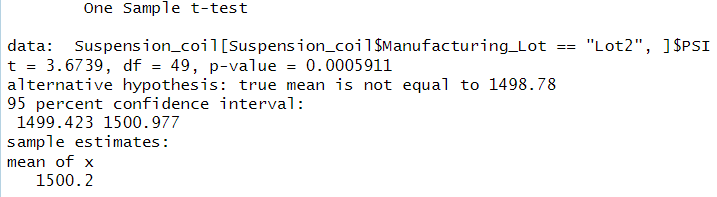

# r-analysis

## Overview:
The purpose of this analysis is to use R to examine vehicle data statistically for the purpose of assisting AutosRUs with their MechaCar prototypes.

## Linear Regression to Predict MPG:

As shown from the linear model's Pr(>|t|) values, Vehicle Length and Ground Clearance are the variables that provide non-random variance to the mpg values. Due to the small p value (0.0000000000535), the slope of this model is not 0. This, in addition to the R-squared values being closer to 1, which indicates that the model fits the data, should indicate that this model predicts the mpg of MechaCar effectively. 

## Summary Statistics on Suspension Coils:

The above data shows that the coils all fail to meet design specifications by exceeding 100 pounds per square inch (PSI), and this is true for both all lots in total and each lot individually. 

## T-Tests on Suspension Coils:

- The t test of the total population has a p value of 1, as expected, as the data and means are the same.

- The p value for lot 1 is 0.0000000000168, which is small enough to reject the null and shows that their mean is statistically different from the overall population of coils. 

- The p value for lot 2 is 0.0005911, which is small enough to reject the null and shows that their mean is statistically different from the overall population of coils. 

- The p value for lot 3 is 0.1589, which is large enough to not reject the null, so its mean is statistically similar to the overall population of coils. 

## Study Design: MechaCar vs Competition
To compare the performance of the MechaCar against vehicles from other manufacturers in snowy conditions:
- Evaluate a metric like mpg in cold and snowy conditions of a variety of competitors.
- Null hypothesis: the MechaCar performs similarly or has similar metrics to other vehicles in these conditions. 
- Perform a series of two sample t tests to compare the MechaCar against the overall population as well as each included competing vehicle. 
- The Miles per Gallon of many individual cars of competing vehicles would need to be evaluated in similar conditions. Something along the lines of 50 individual cars per competing model to have similar sample size to the previous tests. 

